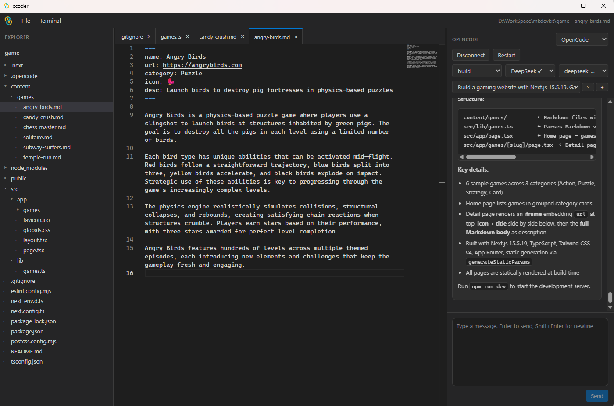

# xcoder



基于 Tauri 的 AI 编程工作台，集成 [CodeWhale](https://www.codewhale.ai/) 与 [OpenCode](https://opencode.ai/)。

**English:** [README.md](./README.md)

## 功能概览

- **三栏布局**：资源管理器 · Monaco 编辑器 · AI 聊天，面板宽度可拖拽调整
- **工程浏览与编辑**：打开本地目录、多标签编辑、保存、外部变更自动重载
- **双 AI 后端**：CodeWhale / OpenCode，流式对话、工具调用、审批门禁
- **会话与历史**：按工程保存本地聊天历史（`.codewhale/history`、`.opencode/history`）
- **类 Cursor 体验**：文件拖入聊天、`@` 路径引用、Markdown 渲染、右键菜单
- **集成终端**：多标签 PTY，工程目录为默认工作路径
- **多语言界面**：中 / 英 / 日 / 法 / 德 / 俄 / 西 / 葡 / 意，首选项内切换即时生效

---

## 快速开始

1. 安装 [前置依赖](#前置依赖) 与至少一个 AI 后端（CodeWhale 或 OpenCode）。
2. 按 [配置说明](#配置说明) 写好 API Key 与 `config.toml`。
3. 启动应用：
   ```bash
   npm install
   npm run tauri dev
   ```
   使用弹出的 **Tauri 桌面窗口**，不要直接在浏览器打开 `http://localhost:1420`。
4. **文件 → 打开工程**，选择项目根目录。
5. 在右侧聊天面板点击 **连接**（会先执行健康检查并后台启动 Runtime）。
6. 从下拉框 **选择历史会话**，或点击 **+** **新建会话**。
7. 输入任务描述并 **发送**；若 AI 请求执行敏感工具，在聊天流中 **允许 / 拒绝**。

---

## 使用指南

### 界面布局

```
┌──────────────────────────────────────────────────────────────┐
│ 菜单栏 · 当前工程路径 · 当前打开文件                            │
├──────────┬─────────────────────────────┬─────────────────────┤
│ 资源管理器 │ 编辑器（多标签）              │ AI 聊天              │
│          │                             │                     │
│          ├─────────────────────────────┤                     │
│          │ 终端（新建后出现，高度可调）   │                     │
└──────────┴─────────────────────────────┴─────────────────────┘
```

- 拖动 **侧栏与聊天栏之间**、**聊天栏左缘** 的分隔条可调整宽度。
- 终端显示后，拖动 **编辑器与终端之间** 的分隔条可调整终端高度。
- 关闭全部终端标签后，终端区域自动隐藏。

### 菜单栏

| 菜单 | 项 | 说明 |
|------|-----|------|
| **文件** | 打开工程 | 选择本地项目根目录 |
| | 首选项 | 在编辑器区域打开可视化设置（语言等） |
| | **配置** → 打开配置目录 | 在系统文件管理器中打开 xcoder 配置目录 |
| | **配置** → 打开配置文件 | 编辑 xcoder 的 `config.toml` |
| | **配置** → 打开 opencode.json | 编辑 OpenCode 全局配置 |
| | **配置** → 打开 codewhale.json | 实际打开 `~/.codewhale/config.toml`（TOML，非 JSON） |
| **终端** | 新建终端 | 在工程目录（若已打开）下启动 PTY |

### 资源管理器

- **打开工程**后显示文件树；点击文件夹展开/折叠，点击文件在编辑器中打开。
- 以下 **点目录** 默认不在树中显示：`.git`、`node_modules`、`target`、`dist`、`.specstory`、`.cursor`。  
  `.codewhale`、`.opencode` 等其它点目录 **会正常显示**（含本地聊天历史目录）。
- **选中** 文件或文件夹后可用快捷键或右键操作（需先让资源管理器获得焦点，点击空白处即可）。

| 操作 | 方式 |
|------|------|
| 新建文件 / 文件夹 | 右键 → 新建 |
| 重命名 | 右键 → 重命名，或 **F2** |
| 删除 | 右键 → 删除，或 **Del**（Tauri 原生确认对话框） |
| 复制路径 | 右键 → 复制路径 |
| 刷新列表 | 右键 → 刷新 |
| 重新打开工程 | 右键 → 打开工程目录 |

### 编辑器

- 支持 **多标签**；标签上的 **●** 表示未保存。
- **Ctrl+S**：保存当前文件。
- 工程目录下的文件被外部修改时，若当前标签 **未脏**，会自动重新加载。
- **文件 → 首选项** 在编辑器中打开虚拟标签 `xcoder://preferences`（不是磁盘文件）。

编辑器标签 **右键**：

| 项 | 说明 |
|----|------|
| 保存 | 保存当前文件（有未保存修改时可用） |
| 重新加载文件 | 从磁盘重新读取 |
| 在目录中查看 | 在系统文件管理器中定位该文件 |
| 关闭标签页 | 关闭当前标签 |

### AI 聊天

#### 推荐工作流

1. **打开工程**（OpenCode 连接时 **必须** 先打开工程）。
2. 点击 **连接** — xcoder 后台启动 `codewhale serve` 或 `opencode serve`（release 版无 CMD 弹窗）。
3. **不会** 自动选中或创建会话；需手动 **选择历史会话** 或 **+ 新建会话**。
4. 编写消息后 **发送**；**Enter** 发送，**Shift+Enter** 换行。
5. 点击 **断开** 会停止 Runtime 并 **清空** 当前会话与消息列表。

#### 面板控件

| 控件 | 说明 |
|------|------|
| Provider 下拉 | 在 `config.toml` 中配置了多个 Provider 时可切换 |
| 模式 | 连接后动态获取 — CodeWhale：`plan` / `agent` / `yolo`；OpenCode：来自 `/agent` |
| 模型商 | 仅 OpenCode — 列出已配置 provider（如 `deepseek`、`zhipu-coding`） |
| 模型 | 连接后动态获取 — CodeWhale：`codewhale model list`；OpenCode：当前模型商下的模型 |
| 连接 / 断开 | 启动或停止 AI Runtime |
| 会话下拉 | 切换历史会话（合并本地与远端列表） |
| × | 删除当前会话（需确认） |
| + | 新建会话 |

#### 拖入文件引用（类 Cursor）

在 **已打开工程** 后，可将文件引用拖入聊天输入框（无需先连接 AI）：

| 来源 | 操作 |
|------|------|
| 资源管理器 | 拖动文件或文件夹到输入框 |
| 编辑器标签 | 拖动已打开的文件标签到输入框 |
| 系统文件管理器 | 将文件拖入输入框（Tauri 窗口级拖放） |

松开后在光标处插入 **`@相对路径`**，例如 `@src/App.tsx`。工程外的文件插入绝对路径形式。多个文件以空格分隔。

#### 工具审批

当 AI 请求执行文件写入、命令等操作时，聊天区会出现 **审批卡片**，点击 **允许** 或 **拒绝**。审批策略也可在 CodeWhale / OpenCode 原生配置中调整（`approval_mode` 等）。

#### 消息展示

- 用户 / AI 消息支持 **Markdown** 渲染。
- 工具调用以折叠卡片展示，可展开查看详情。

### 终端

- **终端 → 新建终端**，或右键空白处 / 终端区域 → 新建终端。
- 默认工作目录为当前 **工程根目录**（若已打开）。
- 多个终端时，右侧显示 **标签侧栏** 切换；标题栏 **+** 新建、**×** 关闭当前。
- 终端内选中文本后 **右键 → 复制**。
- 终端支持 **链接识别**（点击用系统浏览器打开）。

### 首选项与语言

**文件 → 首选项** 打开设置页：

| 设置 | 说明 |
|------|------|
| 界面语言 | 中、英、日、法、德、俄、西、葡、意；切换后立即生效 |
| 外观 | 占位项，后续版本扩展 |

语言保存在浏览器 `localStorage`（键名 `xcoder:locale`）。

### 全局右键菜单

在空白区域右键：

| 项 | 说明 |
|----|------|
| 打开工程目录 | 重新选择工程 |
| 新建终端 | 创建终端 |
| 复制工程路径 | 复制当前工程根路径到剪贴板 |

### 快捷键

| 快捷键 | 作用域 | 功能 |
|--------|--------|------|
| **Ctrl+S** | 全局（编辑器焦点时） | 保存当前文件 |
| **F2** | 资源管理器已选中项 | 重命名 |
| **Del** | 资源管理器已选中项 | 删除（确认） |
| **Enter** | 聊天输入框 | 发送消息 |
| **Shift+Enter** | 聊天输入框 | 换行 |
| **Esc** | 菜单栏 | 关闭菜单 |

> 在输入框、Monaco 编辑器、聊天框内时，F2 / Del 不会触发资源管理器操作。

### 本地聊天历史

- 路径：`<工程>/.codewhale/history/` 或 `<工程>/.opencode/history/`。
- 发送消息、回合结束或出错时 **自动持久化**。
- 会话列表 **合并** 本地与 Runtime 返回的记录，优先保留本地有意义的标题。
- 删除会话会同时清理本地文件与 Runtime 侧记录（若可连接）。

---

## 前置依赖

1. **Node.js** 18+
2. **Rust** — https://www.rust-lang.org/learn/get-started
3. **Tauri 系统依赖** — https://tauri.app/start/prerequisites/
4. **AI 后端（至少装一个）**

```bash
# CodeWhale
npm install -g codewhale
codewhale auth set --provider deepseek --api-key <your-key>
codewhale doctor

# OpenCode
npm install -g opencode
opencode --version
```

---

## 配置说明

xcoder 采用**两层配置**：应用自己的 `config.toml` 负责「连哪个后端、怎么启动」；各 AI 工具保留**原生配置文件**（API Key、模型、审批策略等）。聊天面板的模式与模型在**连接后动态获取**。

| 配置文件 | 作用 | 典型路径 |
|----------|------|----------|
| `config.toml` | xcoder 应用级：默认 Provider、启动命令、健康检查 | Windows: `%APPDATA%\xcoder\config.toml`<br>Linux/macOS: `~/.config/xcoder/config.toml` |
| `config.toml`（CodeWhale） | CodeWhale 原生：API Key、默认模型、审批模式 | `~/.codewhale/config.toml` |
| `opencode.json` | OpenCode 原生：Provider、模型、权限 | `~/.config/opencode/opencode.json` |

首次启动 xcoder 会自动生成 `config.toml`。也可在应用内通过菜单打开：

- **文件 → 配置 → 打开配置目录**
- **文件 → 配置 → 打开配置文件** → xcoder 的 `config.toml`
- **文件 → 配置 → 打开 opencode.json**
- **文件 → 配置 → 打开 codewhale.json** → 实际打开 CodeWhale 的 `~/.codewhale/config.toml`（CodeWhale 官方格式为 TOML，不是 JSON）

界面语言可在 **文件 → 首选项** 中切换（中/英/日/法/德/俄/西/葡/意）。

### 1. `config.toml`（xcoder 应用配置）

以 DeepSeek + 双 Provider 为例：

```toml
[app]
default_provider = "codewhale"   # codewhale | opencode
theme = "dark"

# ── CodeWhale ──────────────────────────────────────────
[[providers]]
id = "codewhale"
type = "http"
command = "codewhale"
args = ["serve", "--http", "--port", "7878", "--insecure"]
config_path = "~/.codewhale/config.toml"
health_cmd = ["codewhale", "doctor", "--json"]

# ── OpenCode ───────────────────────────────────────────
[[providers]]
id = "opencode"
type = "http"
command = "opencode"
args = ["serve", "--hostname", "127.0.0.1", "--port", "4096"]
config_path = "~/.config/opencode/opencode.json"
health_cmd = ["opencode", "--version"]
```

字段说明：

- `default_provider`：聊天面板默认使用的后端
- `command` / `args`：xcoder 点击「连接」时启动的命令（需与 `config_path` 中的端口一致）
- `config_path`：该 Provider 原生配置文件路径，支持 `~` 展开
- `health_cmd`：连接前的健康检查命令

连接后，聊天面板的**模式**与**模型**列表会自动从运行时获取：

| Provider | 模式来源 | 模型来源 | 默认模型 |
|----------|----------|----------|----------|
| **CodeWhale** | 固定 `plan` / `agent` / `yolo` | `codewhale model list` | `doctor --json` → `default_text_model` |
| **OpenCode** | `GET /agent` | Provider API + `~/.config/opencode/opencode.json` | 已连接 provider 的首个模型，或 `opencode.json` 的 `model` |

若在已连接状态下修改了 `opencode.json` 中的 provider，请 **断开后重新连接**，xcoder 会重启 OpenCode 进程并刷新模型列表。

若系统找不到 `codewhale` / `opencode`，可在 `command` 中写绝对路径，例如：

```toml
command = "C:\\Users\\you\\AppData\\Roaming\\npm\\codewhale.cmd"
```

### 2. CodeWhale 配置（`~/.codewhale/config.toml`）

> 菜单项名为「打开 codewhale.json」，实际文件是 **TOML** 格式。

**方式 A：命令行写入 API Key（推荐）**

```bash
codewhale auth set --provider deepseek --api-key <your-deepseek-key>
```

**方式 B：直接编辑配置文件**

```toml
api_key = "<your-deepseek-key>"
provider = "deepseek"
auth_mode = "api_key"
default_text_model = "deepseek-v4-pro"

[providers.deepseek]
api_key = "<your-deepseek-key>"

[ui]
default_mode = "agent"        # plan | agent | yolo
approval_mode = "suggest"     # suggest | auto | never
reasoning_effort = "high"     # off | high | max

[runtime_api]
cors_origins = ["http://localhost:1420"]
```

常用 DeepSeek 模型名：

| 模型 ID | 说明 |
|---------|------|
| `deepseek-v4-pro` | 主力模型（推荐） |
| `deepseek-v4-flash` | 更快、更省 |

验证：

```bash
codewhale doctor
codewhale doctor --json
```

`default_text_model` 也会在 xcoder 点击 **连接** 后作为聊天面板模型下拉的初始选中项（完整列表来自 `codewhale model list`）。

### 3. OpenCode 配置（`opencode.json`）

全局配置文件路径：`~/.config/opencode/opencode.json`（也可在项目根目录放置 `opencode.json` 覆盖全局设置）。

以 DeepSeek 为例（与 xcoder 当前环境兼容的写法）：

```json
{
  "$schema": "https://opencode.ai/config.json",
  "model": "deepseek/deepseek-v4-pro",
  "provider": {
    "deepseek": {
      "npm": "@ai-sdk/openai-compatible",
      "options": {
        "baseURL": "https://api.deepseek.com/v1",
        "apiKey": "<your-deepseek-key>",
        "setCacheKey": true
      },
      "models": {
        "deepseek-v4-pro": { "name": "deepseek-v4-pro" },
        "deepseek-v4-flash": { "name": "deepseek-v4-flash" }
      }
    }
  }
}
```

要点：

- `apiKey` 填 DeepSeek 平台的 Key（https://platform.deepseek.com）
- `models` 中的 key 必须使用 `deepseek-v4-pro` / `deepseek-v4-flash`，**不要**写成 `v4-pro`（会导致 API 400 错误）
- `model` 格式为 `providerID/modelID`，例如 `deepseek/deepseek-v4-pro`
- 连接后，xcoder 会从 OpenCode API 读取 provider 与模型，并合并 `opencode.json`；在聊天面板用 **模型商**、**模型** 下拉框切换
- 自定义 provider（如 `zhipu-coding`）须写在 `opencode.json` 中且被 OpenCode 成功加载（`connected`）；若连接后修改配置，需 **断开再连接**

验证：

```bash
opencode --version
opencode serve --hostname 127.0.0.1 --port 4096
```

### 配置关系一览

```
~/.config/xcoder/config.toml          ← xcoder：Provider、启动参数、健康检查
        │                                 （连接后动态获取模式与模型）
        ├─ config_path ──→ ~/.codewhale/config.toml     ← API Key、默认模型、审批
        │
        └─ config_path ──→ ~/.config/opencode/opencode.json  ← Provider、模型、权限

<工程目录>/.codewhale/history/        ← CodeWhale 本地聊天历史（xcoder 写入）
<工程目录>/.opencode/history/         ← OpenCode 本地聊天历史（xcoder 写入）
```

更完整的架构说明见 [architecture.md](./architecture.md)。

---

## 开发

```bash
npm install
npm run tauri dev
```

请在 Tauri 桌面窗口中使用（`npm run tauri dev`），不要直接在浏览器打开 `http://localhost:1420`。

## 构建

```bash
npm run tauri build
```

产物位置：

- 可执行文件：`src-tauri/target/release/xcoder.exe`
- 安装包（NSIS）：`src-tauri/target/release/bundle/nsis/xcoder_0.1.0_x64-setup.exe`

默认只打 **NSIS** 安装包（Windows 常用），不打 MSI，避免构建时从 GitHub 下载 WiX 工具失败。

若构建报错 `timeout: global` 或下载 WiX/NSIS 失败，通常是 Tauri CLI 内置下载器访问 GitHub 超时（PowerShell 往往可以正常下载）。可先执行：

```powershell
npm run tauri:setup-bundle-tools
npm run tauri build
```

该脚本会把 NSIS 工具预装到 `%LOCALAPPDATA%\tauri\NSIS`。也可直接使用已编译好的 exe，不必等安装包。

## 常见问题

| 现象 | 处理 |
|------|------|
| 浏览器打开 `localhost:1420` 无法使用 | 必须用 `npm run tauri dev` 的桌面窗口；Tauri 后端 API 仅在桌面环境可用 |
| 连接时报「未找到 codewhale/opencode」 | 全局安装 CLI，或在 `config.toml` 的 `command` 写 `.cmd` / `.exe` 绝对路径 |
| 连接时弹出 CMD 黑窗（旧版本） | 已通过 `CREATE_NO_WINDOW` 隐藏子进程控制台；请使用最新构建的 exe |
| OpenCode 连接失败 | 须先 **打开工程**；检查 `opencode.json` 端口与 `config.toml` 的 `args` 一致 |
| OpenCode 聊天区看不到某 provider/模型 | 修改 `opencode.json` 后 **断开再连接** 以重启 Runtime；自定义 provider 需有效 `apiKey` 或 `opencode auth login` |
| 聊天无响应 / 400 错误 | 检查 DeepSeek 模型名是否为 `deepseek-v4-pro`，勿写成 `v4-pro` |
| 构建下载 WiX/NSIS 超时 | 运行 `npm run tauri:setup-bundle-tools` 后重试 |

## 项目结构

```
src/           React 前端（面板、聊天、i18n、状态管理）
src-tauri/     Rust 后端（文件系统、配置、Agent 适配、终端 PTY）
```
