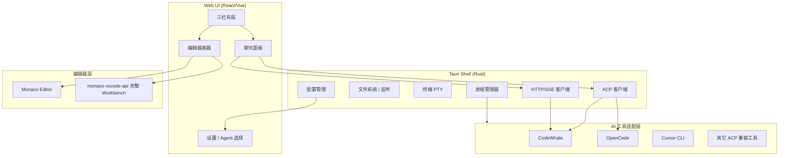

# xcoder 架构设计

基于 Tauri 的可交互 AI 编程工作台，类似 Cursor 客户端：左侧工程浏览、中间编辑器、右侧 AI 聊天，支持多种 AI 工具。首期以 **CodeWhale** 为主要集成目标。

---

## 总体架构



核心思路：**Tauri 做壳和进程编排，前端做 UI，Rust 做 AI 协议适配，编辑器分阶段演进。**

---

## 技术选型

| 层级 | 推荐方案 | 理由 |
|------|----------|------|
| 桌面壳 | **Tauri 2** | 体积小、Rust 后端、原生文件/进程/PTY |
| 前端 | **React + Vite** 或 **Vue 3** | 生态成熟，聊天 UI 好做 |
| 编辑器 MVP | **Monaco Editor** | 快速上线，语法高亮、diff |
| 编辑器完整版 | **monaco-vscode-api** + **monaco-vscode-server** | 接近 VS Code：LSP、扩展、主题 |
| AI 协议（首期） | **CodeWhale HTTP/SSE API** | 线程、审批、模式切换、工具调用完整 |
| AI 协议（通用） | **ACP (Agent Client Protocol)** | CodeWhale、OpenCode 等均支持，便于扩展 |

参考项目：

- [Blink](https://github.com/bmarti44/blink) — Tauri + monaco-vscode-api 的完整 IDE
- [SideX](https://dev.to/kendallbooker/i-rebuilt-vs-code-on-tauri-instead-of-electron-and-just-open-sourced-it-53ao) — Tauri 版 VS Code 思路
- [CodeWhale Runtime API](https://github.com/Hmbown/CodeWhale/blob/main/docs/RUNTIME_API.md) — 首期 AI 集成契约

---

## UI 布局（类 Cursor）

```
┌─────────────────────────────────────────────────────────────┐
│  菜单栏：打开工程 | 选择 Agent | 模式 | 模型 | 设置          │
├──────────┬──────────────────────────────┬───────────────────┤
│ 文件树   │  编辑器 / Diff / 终端        │  AI 聊天面板       │
│ Git 状态 │  (Monaco 或 VS Code Workbench)│  - 消息流         │
│ 搜索     │                              │  - 工具调用卡片    │
│          │                              │  - 审批按钮        │
│          │                              │  - Agent/模式切换  │
└──────────┴──────────────────────────────┴───────────────────┘
```

---

## AI 工具适配层

不为每个工具单独写 UI，而是统一抽象：

```rust
// src-tauri/src/agent/mod.rs
pub trait AgentProvider {
    fn id(&self) -> &str;
    fn display_name(&self) -> &str;
    fn health_check(&self) -> Result<HealthStatus>;
    fn list_agents(&self) -> Result<Vec<AgentInfo>>;      // plan/agent/yolo 等
    fn list_models(&self) -> Result<Vec<ModelInfo>>;
    fn create_session(&self, workspace: &Path) -> Result<SessionId>;
    fn send_message(&self, session: &SessionId, msg: &str) -> Result<()>;
    fn subscribe_events(&self, session: &SessionId) -> EventStream;
    fn approve_tool(&self, approval_id: &str, allow: bool) -> Result<()>;
}
```

### 三种集成方式

#### 1. HTTP/SSE（CodeWhale 首期首选）

CodeWhale 提供完整 Runtime API（`codewhale serve --http`）：

- 线程/会话管理（`GET/POST /v1/threads`）
- SSE 流式事件（`GET /v1/threads/{id}/events`）
- 工具审批（`POST /v1/approvals/{id}`）
- 模式切换（`PATCH /v1/threads/{id}`，`mode: plan | agent | yolo`）
- 健康检查（`codewhale doctor --json`）

适合需要审批门禁、线程历史、steer/interrupt 的完整体验。

启动示例：

```bash
codewhale serve --http --host 127.0.0.1 --port 7878
```

CORS 需允许 Tauri 开发端口（内置支持 `tauri://localhost`、`http://localhost:1420` 等）。

#### 2. ACP（通用扩展）

JSON-RPC over stdio，适合编辑器类集成：

| 工具 | 启动命令 |
|------|----------|
| CodeWhale | `codewhale serve --acp` |
| OpenCode | `opencode acp --cwd <workspace>` |
| 未来工具 | 只要支持 ACP 即可接入 |

Rust 侧用 `tokio::process::Command` 拉起子进程，stdin/stdout 做 JSON-RPC。ACP 版 CodeWhale 功能较 HTTP 保守（不含完整 shell/文件写入工具），适合轻量对话场景。

#### 3. CLI 包装（兜底）

例如 `cursor-agent`、`claude` 等，用 PTY 或 stdout 解析，优先级最低。

---

## CodeWhale 集成要点

### 模式与审批

CodeWhale 有两条独立轴，UI 需分别暴露：

| 轴 | 选项 | 说明 |
|----|------|------|
| **Mode** | `plan` / `agent` / `yolo` | plan 只读；agent 逐条审批；yolo 自动批准 |
| **Approval** | `suggest` / `auto` / `never` | 审批策略（对应 `~/.codewhale/config.toml` 的 `[ui]` 段） |

通过 `PATCH /v1/threads/{id}` 可在运行时切换 `mode`、`model`、`auto_approve` 等。

### 关键 API 流程

```
1. codewhale doctor --json          → 检查安装与 API Key
2. codewhale serve --http           → 启动本地 Runtime（获取 auth token）
3. POST /v1/threads                 → 创建工作区线程
4. POST /v1/threads/{id}/turns     → 发送用户消息
5. GET  /v1/threads/{id}/events     → SSE 订阅流式回复与工具事件
6. POST /v1/approvals/{id}          → 用户审批工具调用
```

### SSE 事件（统一映射到前端）

常见事件名：`turn.started`、`item.delta`、`item.completed`、`approval.required`、`file_change`、`turn.completed` 等。Rust 适配层将其转为内部 `AgentEvent` 格式。

### 原生配置

CodeWhale 配置位于 `~/.codewhale/config.toml`（兼容旧路径 `~/.deepseek/config.toml`）：

```toml
api_key = "sk-..."
base_url = "https://api.deepseek.com"
default_text_model = "deepseek-v4-pro"

[ui]
default_mode = "agent"       # plan | agent | yolo
approval_mode = "suggest"    # suggest | auto | never
reasoning_effort = "high"    # off | high | max

[runtime_api]
cors_origins = ["http://localhost:5173"]
```

xcoder UI 修改模式/模型时，应写回此文件或通过 Runtime API 的 `PATCH` 接口同步。

---

## 配置文件设计

两层配置：**xcoder 总配置** + **各工具原生配置**（不重复造轮子）。

### `~/.config/xcoder/config.toml`（应用级）

```toml
[app]
default_provider = "codewhale"
default_workspace = "~/projects"
theme = "dark"

[[providers]]
id = "codewhale"
type = "http"                    # acp | http | cli
command = "codewhale"
args = ["serve", "--http", "--port", "7878"]
config_path = "~/.codewhale/config.toml"
health_cmd = ["codewhale", "doctor", "--json"]

[[providers]]
id = "opencode"
type = "http"
command = "opencode"
args = ["serve", "--hostname", "127.0.0.1", "--port", "4096"]
config_path = "~/.config/opencode/opencode.json"
health_cmd = ["opencode", "--version"]
```

连接后，聊天面板的模式与模型从运行时动态获取（CodeWhale：`codewhale model list` + `doctor --json`；OpenCode：`/agent` + provider API）。

---

## 编辑器分阶段实现

### 阶段 1：Monaco MVP（1–2 周）

- `@monaco-editor/react` 嵌入
- Tauri `plugin-fs` 读写文件
- `plugin-dialog` 打开工程目录
- `notify` 监听文件变化
- 聊天面板 + CodeWhale HTTP/SSE 基础对话

够用，但无 LSP、无扩展市场。

### 阶段 2：monaco-vscode-api（4–8 周）

- Rust 侧用 [monaco-vscode-server](https://github.com/entrepeneur4lyf/monaco-vscode-server) 管理 VS Code Server
- 前端接入 `@codingame/monaco-vscode-api`
- 支持：LSP、Open VSX 扩展、主题、多文件 Tab、集成终端

这是「类 VS Code 编辑器」的正解，与 Blink 路线一致。

### 阶段 3（可选）：code-server 嵌入

更重（需 Node 运行时），一般不如 monaco-vscode-api 适合 Tauri。

---

## 推荐目录结构

```
xcoder/
├── architecture.md              # 本文档
├── src-tauri/
│   ├── src/
│   │   ├── main.rs
│   │   ├── commands/            # Tauri invoke 命令
│   │   ├── fs/                  # 文件树、读写、watch
│   │   ├── pty/                 # 终端
│   │   ├── config/              # 配置加载与映射
│   │   └── agent/
│   │       ├── mod.rs           # AgentProvider trait
│   │       ├── acp/             # ACP JSON-RPC 客户端
│   │       ├── http_sse/        # CodeWhale HTTP 适配
│   │       ├── cli/             # CLI 包装
│   │       └── providers/
│   │           ├── codewhale.rs
│   │           └── opencode.rs
│   └── Cargo.toml
├── src/
│   ├── App.tsx
│   ├── layouts/
│   │   └── WorkbenchLayout.tsx
│   ├── panels/
│   │   ├── FileExplorer/
│   │   ├── ChatPanel/
│   │   ├── EditorPanel/
│   │   └── TerminalPanel/
│   ├── components/
│   │   ├── MessageBubble.tsx
│   │   ├── ToolCallCard.tsx     # 文件修改、shell 命令
│   │   └── ApprovalGate.tsx     # 审批 UI
│   ├── stores/
│   │   ├── workspace.ts
│   │   ├── chat.ts
│   │   └── settings.ts
│   └── services/
│       └── editor/              # Monaco 或 vscode-api 初始化
├── package.json
└── README.md
```

---

## 聊天面板关键能力

1. **流式渲染** — SSE `item.delta` 增量显示
2. **工具调用卡片** — 文件编辑、shell、搜索，可展开详情
3. **审批门禁** — `approval.required` → Allow/Deny 按钮
4. **模式切换** — Plan / Agent / YOLO
5. **@ 引用** — 选中代码、当前文件、整个工程
6. **Diff 预览** — Agent 改文件后在编辑器中高亮 diff
7. **会话历史** — 线程列表（`GET /v1/threads/summary`）、恢复、归档

### 统一事件格式

不同 Provider 在 Rust 适配层转为同一格式，前端只写一套 UI：

```typescript
type AgentEvent =
  | { type: "text_delta"; content: string }
  | { type: "reasoning_delta"; content: string }
  | { type: "tool_call"; name: string; args: unknown }
  | { type: "tool_result"; output: string }
  | { type: "approval_required"; id: string; description: string }
  | { type: "file_change"; path: string; diff: string }
  | { type: "turn_completed" };
```

---

## 分阶段路线图

| 阶段 | 目标 | 产出 |
|------|------|------|
| **P0** | 脚手架 | Tauri 2 + React + 三栏布局 |
| **P1** | 工程浏览 | 打开目录、文件树、Monaco 编辑 |
| **P2** | CodeWhale 聊天 | HTTP/SSE 接入，基础对话与流式渲染 |
| **P3** | 配置系统 | 多 Provider 配置、UI 选项、写回原生配置 |
| **P4** | CodeWhale 完整能力 | 审批、模式切换、线程历史、steer/interrupt |
| **P5** | 编辑器升级 | monaco-vscode-api + LSP + 扩展 |
| **P6** | 打磨 | 终端、Git、Diff、快捷键 |

---

## 关键设计决策

1. **CodeWhale HTTP 首期，ACP 扩展** — 先用 HTTP/SSE 拿完整能力，其它工具走 ACP
2. **配置不重复** — xcoder 只做路由与 UI 映射，参数写回各工具原生配置
3. **编辑器分阶段** — 先 Monaco 验证产品，再换完整 Workbench
4. **Rust 管进程** — AI 子进程、PTY、文件监听放 Rust，前端只管展示
5. **事件统一** — 前端不感知 CodeWhale/OpenCode 协议差异

---

## 前置依赖

开发前需安装：

```bash
# CodeWhale
npm install -g codewhale
codewhale auth set --provider deepseek --api-key <key>
codewhale doctor

# Tauri 开发环境
# Rust, Node.js 18+, 平台 WebView2（Windows）
```
